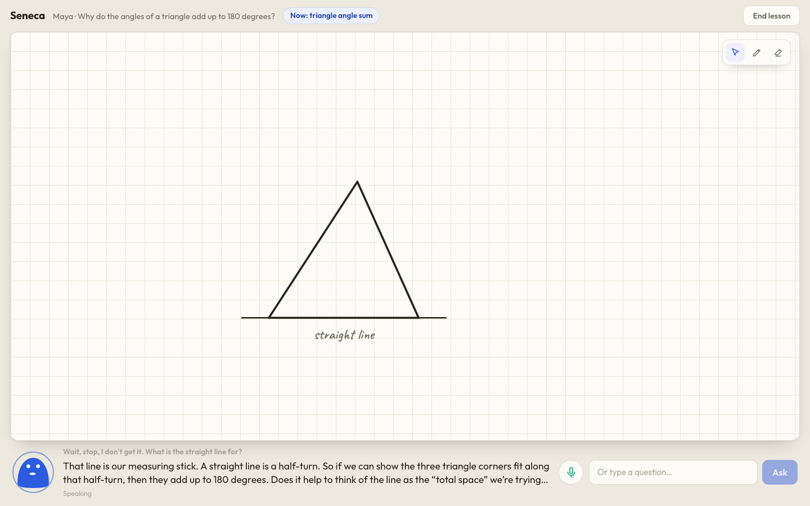

# Seneca

A voice-first AI tutor for children that teaches at a live whiteboard.
Seneca talks with the child, draws precise visuals in sync with its own
speech, can be interrupted mid-sentence, adapts its explanation to what
the child actually says and turns the session into honest, evidence-based
notes for a parent.

## What a lesson looks like

1. A parent picks (or adds) a learner and a goal on the home screen.
2. The child lands in the lesson workspace and presses **Start**.
3. Seneca greets them by name and starts teaching out loud, drawing on
   the board as it speaks: shapes, angle arcs, graphs, number lines,
   process diagrams, typeset equations.
4. The child just talks. Interrupting mid-sentence stops the voice
   locally in ~1ms, cancels stale drawing and Seneca answers what was
   actually asked. Typing works too and the child can draw on the board.
5. During the lesson Seneca records structured evidence ("struggled with
   X, high confidence, they said: …") and keeps a visible lesson state.
6. **End lesson** produces a calibrated summary; the parent dashboard
   shows what was worked on, strengths and struggles *with the evidence
   for each* and a recommended next step. No invented percentages.



More: [line graph](docs/screenshots/lesson-line-graph.png) ·
[metaphor vs simile](docs/screenshots/lesson-metaphor-simile.png) ·
[a topic with no natural diagram](docs/screenshots/lesson-no-diagram-topic.png) ·
[parent dashboard](docs/screenshots/parent-dashboard.png) ·
[home](docs/screenshots/home.png) ·
[mobile](docs/screenshots/lesson-mobile.png)

## Setup

Requires Node 22.5+ (uses the built-in `node:sqlite`; developed on 24.x).

```bash
npm install
cp .env.example .env   # then fill in OPENAI_API_KEY
npm run dev            # frontend (5173) + backend (8787) together
```

Open http://localhost:5173, add a learner, pick a goal, start the lesson.
Chrome is the best-tested browser. Use headphones for the smoothest
barge-in behaviour (echo cancellation handles speakers well, but
headphones make interruption detection sharper).

## Architecture (short version)

Two evidence-based decisions shape the system: measurements and rejected
alternatives are in `docs/architecture/2026-08-22-live-tutor-architecture.md`.

**Voice**: native speech-to-speech via OpenAI Realtime
(`gpt-realtime-2.1`), proxied through the Express server over WebSocket
(`/ws/lesson`). The key never reaches the browser and the server records
the same event stream that drives the child's screen: one source of
truth for lesson and dashboard. The browser plays PCM through Web Audio
with a per-response sample clock, so:

- interruption stops audio locally without a network round-trip,
- captions and board marks are released exactly when speech reaches them
  (the model generates ahead of playback),
- truncation tells the model precisely how much the child heard.

**Visuals**: the model emits semantic operations (`board_ops`), never
pixels: polygons, circles, angle marks, labelled points, axes with
plotted functions or data, bar charts, number lines, boxes, connectors,
tables, KaTeX equations, plus `highlight`/`update`/`erase` against stable
object ids. Every op is validated server-side; geometry (arcs, ticks,
curve sampling via a safe expression parser, label anchoring with
collision nudging, bounds clamping) is computed deterministically in the
client compiler. Strokes animate on with a pen tracer that follows the
line being drawn and hurry up if speech runs ahead.

**Memory**: children, sessions, events and evidence live in SQLite
(`data/seneca.db`, created automatically, gitignored). A page refresh
replays exactly the marks the child saw and resumes the conversation
with context. Ending a session generates the parent summary from the real
transcript and recorded evidence.

**Fallbacks**: each failure degrades honestly:

- microphone denied → typing works, Seneca still speaks;
- realtime connection failing → four reconnect attempts, then a labelled
  captions-only text mode over HTTP (same board language, same session
  store), never fake audio;
- missing `OPENAI_API_KEY` → the home screen says lessons can't run;
- invalid model-drawn ops → rejected server-side, reported back to the
  model, the lesson continues;
- thin evidence → the summary says so instead of inventing conclusions.

## Scripts

- `npm run dev`: frontend + backend together
- `npm run build`: typecheck + production build
- `npm run typecheck:server`: backend typecheck
- `npm test`: unit tests (validation, expression parser, scene,
  compiler layout, store)
- `npm run lint`: oxlint
- `node scripts/e2e-live.mjs [wav]`: full journey in a real browser;
  pass a WAV to use it as a fake microphone (spoken barge-in test)
- `node scripts/topic-matrix.mjs`: unseen-topic matrix across five
  domains, with screenshots
- `node scripts/stress.mjs`: interruption storm, refresh/replay,
  learner-drawing tests
- `node scripts/fallback-test.mjs`: degraded text-mode check (run the
  server with `OPENAI_REALTIME_MODEL=gpt-bogus-model`)

`/dev/board` is a renderer test bench with canned scenes from four
teaching domains.

## Observed performance (local, 2026-08-23)

- typed question → first audible reply: ~0.75s
- start pressed → first caption: ~2.4–3.5s (includes session setup)
- spoken barge-in → local silence: ≤1ms (server confirmation ~150–170ms)
- truncation reports the exact heard milliseconds of the interrupted item

Network latency to the provider is not controllable from here; these are
honest local measurements, not guarantees.

## Known limitations

- One active lesson per browser tab; no authentication (demo scope).
- SQLite is durable for a local demo; a serverless deployment would need
  a managed database.
- The client-side barge-in energy gate can trigger on loud non-speech
  noise while the tutor is speaking (the server's semantic VAD is the
  arbiter; false trips recover on the next turn).
- Evidence quality depends on the model calling `record_evidence`;
  short sessions may end with little evidence and the summary says so.
- WhatsApp/notification delivery is out of scope; the session summary
  row is the clean integration point for it later.
