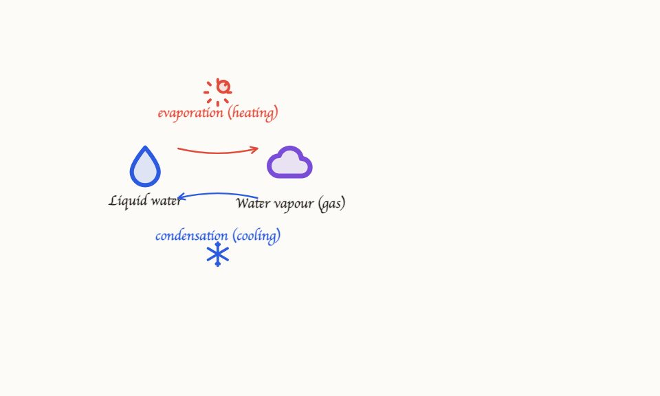

# LearnWithNoura

A voice tutor that explains a topic while drawing on a shared whiteboard. Learners can answer by speaking, typing or drawing. A parent summary links back to the work shown during the session.

The main engineering challenge is coordinating speech, drawing and interruption. The server schedules the lesson while a typed board compiler turns visual requests into geometry. Browser acknowledgements determine when a drawing can enter the session replay.

**Status:** a synthetic demo and engineering prototype. Use pretend learner details. Educational outcomes and readiness for real parent or child use have not been established. The [hosted demo](https://learnwithnoura.com) is managed separately.



*Retained drawing-evaluation example. The full scene was checked offline; the live test captured only part of its reveal.*

## How it works

1. **Compile the lesson.** The parent objective becomes stages, checks and misconception branches before the call starts.
2. **Coordinate speech.** Audio uses WebRTC between the browser and provider. The server controls response creation through a separate connection.
3. **Build the drawing.** A compiled anchor, template or scene generator supplies typed BoardOps. Geometry and policy checks run before the browser reveals them. Equations and labels remain exact overlays.
4. **Record visibility.** `ops_presented` marks first paint. `ops_shown` marks durable work and releases it for replay.
5. **Handle interruption.** Cancelling a generation stops pending work while preserving visible tutor drawings. Learner drafts stay private until **Done**. The storyboard resumes at its first unrevealed step.
6. **Save the session.** Summary evidence must belong to the session and meet its release rules. Late results cannot publish after the session ends.

This separates the tutor's request from the drawing that actually appeared. The same distinction keeps captions, replay and parent summaries consistent when asynchronous work finishes out of order.

## Code guide

| Area | Entry points |
| --- | --- |
| Drawing language and compiler | [BoardOps](shared/boardOps.ts), [scene compiler](src/board/compile.ts) and [quality checks](src/board/quality.ts) |
| Lesson planning | [Lesson compiler](server/lesson/) and [turn contract](shared/lessonTurn.ts) |
| Drawing delivery | [Streaming director](server/board/streamingDirector.ts) and [template routing](server/board/templateLane.ts) |
| Playback and cancellation | [Storyboard runner](server/realtime/storyboardRunner.ts), [client session](src/lesson/realtimeSession.ts) and [generation scope](src/lesson/generationScope.ts) |
| Storage | [Domain contracts](server/store/domain.ts), [local repository](server/store/repo.ts) and [Postgres adapter](server/store/postgresRepo.ts) |

## Try the implementation

Use **Node.js 24** (the SQLite adapter uses `node:sqlite`) and npm. A clean checkout includes the lockfile and the images required by the historical evidence verifiers.

```bash
git clone https://github.com/TahaKhanM/LearnWithNoura.git
cd LearnWithNoura
npm ci
cp .env.example .env
npm run dev
```

Open [localhost:5173/dev/board](http://localhost:5173/dev/board) to inspect the deterministic scenes and board interactions. The example environment has an empty provider key and `NOURA_LESSON_COMPILER=fixture`; this route works without an account or paid API calls. The home page reports the missing provider honestly and does not offer a working voice lesson in this mode. The browser tests exercise complete lesson journeys with fake voice and control transports.

For a provider-backed **local** synthetic lesson, configure `OPENAI_API_KEY`, remove the fixture flag and explicitly set `NOURA_AUTHORIZED_LIVE_RUN=true` before starting the server. This enables paid API use. Model IDs and account access must match your provider account; checked-in defaults describe this implementation, not a guarantee that every account can run them. Keep keys on the server. See [.env.example](.env.example) and [runtime configuration](server/runtimeConfig.ts).

```bash
npm run gate:quick                 # server types, lint and unit/contract tests
npm run build                     # client types and production assets
npx playwright install chromium
npm run test:e2e
npm run test:a11y
# Optional local database check; requires PostgreSQL binaries:
npm run test:postgres
```

SQLite data is created under `data/` and ignored by Git. `NOURA_DATA_DIR` selects another directory. The Vite development proxy sends API and control WebSocket traffic to port 8787. `NOURA_BACKEND_PORT` and `NOURA_PORT` must agree if that port changes. The old database filename remains supported through a checked migration that preserves a backup; the legacy name is not the product name.

`NOURA_DIRECTOR_PIPELINE=streaming|classic` selects drawing delivery. Local and preview environments use streaming with low composition effort. Production retains classic with medium effort as the rollback path. See [.env.example](.env.example) for configuration.

## Evaluation

The retained streaming study measured median first paint at **2,818 ms**, compared with **4,909 ms** for the classic pipeline. These are synthetic browser measurements. They do not measure audio latency or production performance.

Offline checks cover board geometry, storage contracts, interruption, browser journeys and accessibility. Some commands verify saved live-test evidence rather than making a new provider call. The [verification guide](docs/verification.md) explains the distinction. The [architecture index](docs/architecture/INDEX.md) links to results and unresolved milestones, including the curriculum study whose formal acceptance remains false.

## Remaining work

The demo needs a complete identity system, privacy and retention operations, real-minor safety evaluation and audio measurements on target hardware before real family use. Raw audio is not persisted by the application, but voice and lesson content are sent to the configured provider. Rate limits currently apply per process.

Hosted storage requires a restricted Postgres role and verified TLS. `NOURA_DATABASE_CA_CERT` supplies the provider CA. Drawing checks catch structural errors; educational and semantic correctness still require evaluation.

## Credits

This project began as **Seneca**, a collaborative prototype by [Mohammed Talab](https://github.com/MohiCodeHub). **Muhammad Taha** subsequently developed the lesson runtime, board compiler, playback coordination, session evidence and drawing evaluation work.

The public name is LearnWithNoura. Existing `NOURA_*` settings and database migration aliases remain compatible. Later repairs and evaluations are dated in the history. No blanket open-source licence has been added to the collaborative source.
