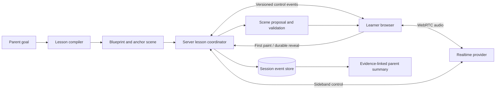

# LearnWithNoura

LearnWithNoura is a voice tutor with a shared teaching whiteboard. A parent chooses a small learning objective; Noura explains it aloud, builds a diagram in stages, accepts spoken, typed or drawn answers and produces a parent summary linked to session evidence.

The difficult part is keeping the lesson truthful when speech, model output, drawing and interruptions finish at different times. This implementation uses a deterministic board compiler, browser acknowledgements and an explicit lesson state machine to decide what the learner has actually seen and heard. A generated scene is a proposal until it passes validation; a queued drawing is not yet replayable evidence.

**Status:** a synthetic demonstration and engineering prototype. The code supports a login-gated demo at [learnwithnoura.com](https://learnwithnoura.com); that deployment is managed separately from this repository. Real parent/child use, educational efficacy and production privacy readiness have not been established. Use pretend learner details only.


*An original retained diagram from the drawing evaluation. The completed scene above was browser-validated offline; the accompanying live smoke observed only part of its reveal sequence. It is not a screenshot of a new live evaluation.*

## Try the implementation

Use **Node.js 24** (the SQLite adapter uses `node:sqlite`) and npm. A clean checkout includes the lockfile and the images required by the historical evidence verifiers.

```bash
git clone https://github.com/TahaKhanM/LearnWithNoura.git
cd LearnWithNoura
npm ci
cp .env.example .env
npm run dev
```

Open [localhost:5173/dev/board](http://localhost:5173/dev/board) to inspect the deterministic scenes and board interactions. The example environment has an empty provider key and `NOURA_LESSON_COMPILER=fixture`; this route works without an account or paid API calls. The home page reports the missing provider honestly and does not offer a working voice lesson in this mode. The browser tests exercise complete lesson journeys with fake voice and control transports.

For a provider-backed **local** synthetic lesson, configure `OPENAI_API_KEY`, remove the fixture flag and explicitly set `NOURA_AUTHORIZED_LIVE_RUN=true` before starting the server. This enables paid API use. Model IDs and account access must match your provider account; checked-in defaults describe this implementation, not a guarantee that every account can run them. Keep keys on the server. See [.env.example](.env.example) and [runtime configuration](server/runtimeConfig.ts).

```bash
npm run gate:quick                 # server types, lint and unit/contract tests
npm run build                     # client types and production assets
npx playwright install chromium
npm run test:e2e
npm run test:a11y
```

SQLite data is created under `data/` and ignored by Git. `NOURA_DATA_DIR` selects another directory. The Vite development proxy sends API and control WebSocket traffic to port 8787. `NOURA_BACKEND_PORT` and `NOURA_PORT` must agree if that port changes. The old database filename remains supported through a checked migration that preserves a backup; the legacy name is not the product name.

## How a lesson works



1. **Plan before the call.** The compiler turns the objective into stages, checks, misconception branches and an optional anchor scene. An ambiguous goal returns candidate objectives. A failed compilation does not start a lesson with an incomplete plan.
2. **Give speech and control separate owners.** Audio travels directly between the browser and provider over WebRTC. The server's sideband owns session configuration and response creation; the browser-to-server WebSocket carries control events rather than PCM audio.
3. **Compile intent into exact geometry.** The voice model requests a visual by intent. An existing anchor, one of three deliberately narrow template exemplars or the streaming Director supplies a scene. BoardOps and scene schemas constrain the vocabulary; geometry, layout and policy checks run before reveal. Text and equations remain exact overlays even when an illustration is generated.
4. **Acknowledge what appeared.** `ops_presented` marks the first committed paint. `ops_shown` marks completed, durable tutor work and releases it for replay. Failed or timed-out proposals do not enter the released event history.
5. **Keep interruption local and scoped.** Confirmed speech interruption cancels the current generation's transient work. Visible tutor work stays, learner drafts remain under learner control until **Done** and a storyboard resumes from its first unrevealed step. Captions track actual playback boundaries rather than assuming that a completed transcript was heard.
6. **Summarize evidence, not hidden activity.** Session ending fixes an immutable event cutoff. Continuation creates a linked session. Parent summaries use released events and source-linked observations rather than treating unrevealed output as a completed lesson.

## Decisions and costs

| Choice | Why it is here | Cost and credible alternative |
| --- | --- | --- |
| Typed BoardOps and deterministic layout | Makes exact equations, geometry, ownership and permanence inspectable and testable. | A bounded grammar limits visual freedom. Raster-only generation is simpler for illustration, but cannot reliably preserve exact labels or editable semantic objects. |
| Browser preflight is the final rendering gate | Validates with the actual font metrics, scene compiler and renderer the learner will use. | The server waits for a connected client and must handle stale acknowledgements. A headless server renderer is useful for offline evaluation, but can disagree with the live browser. |
| First paint and durable reveal are distinct | Separates responsiveness from replay correctness, particularly when an animation is interrupted. | More protocol state and tests than a single “drawn” event; useful only because playback, animation and persistence have independent lifecycles. |
| Server-owned response creation | Gives interruption, tool results and lesson handoffs one scheduling authority. | Sideband setup and reconnect handling are substantial. A simple request/response tutor would be easier for a text-only product. |
| SQLite locally, asynchronous Postgres when hosted | Local development needs no database service; hosted sessions need durable shared storage. | Both adapters must satisfy the same domain contracts. SQLite telemetry is moved to a worker to avoid blocking live control work. |
| Vision audit is advisory | A second model can flag a suspicious diagram without becoming the authority for correctness. | It adds latency and cost and can miss semantic mistakes. Deterministic checks cannot prove pedagogical correctness either; human evaluation remains necessary. |

Large scheduling modules remain cohesive where splitting them would distribute ownership of one state machine. The implementation separates scene proposal, policy, geometry, playback truth and persistence at their actual boundaries rather than introducing a service for each operation.

`NOURA_DIRECTOR_PIPELINE=streaming|classic` selects drawing delivery. Local and preview environments default to streaming with low composition effort; production retains classic with medium effort. Classic is the retained rollback while the streaming deployment boundary is evaluated. The runtime model and reasoning settings are explicit in `.env.example`; this release does not change them.

## Where to inspect the code

| Area | Entry points |
| --- | --- |
| API, startup and readiness | [`server/app.ts`](server/app.ts), [`server/runtimeConfig.ts`](server/runtimeConfig.ts), [`server/security.ts`](server/security.ts) |
| Lesson compilation | [`server/lesson/`](server/lesson/), [`shared/lessonTurn.ts`](shared/lessonTurn.ts) |
| Drawing contract and compiler | [`shared/boardOps.ts`](shared/boardOps.ts), [`src/board/compile.ts`](src/board/compile.ts), [`src/board/quality.ts`](src/board/quality.ts) |
| Director and narrow template routing | [`server/board/streamingDirector.ts`](server/board/streamingDirector.ts), [`server/board/templateLane.ts`](server/board/templateLane.ts) |
| Reveal, narration and cancellation | [`server/realtime/storyboardRunner.ts`](server/realtime/storyboardRunner.ts), [`src/lesson/realtimeSession.ts`](src/lesson/realtimeSession.ts), [`src/lesson/generationScope.ts`](src/lesson/generationScope.ts) |
| Persistence and parent ownership | [`server/store/domain.ts`](server/store/domain.ts), [`server/store/repo.ts`](server/store/repo.ts), [`server/store/postgresRepo.ts`](server/store/postgresRepo.ts) |
| Browser journeys and visual regressions | [`tests/e2e/`](tests/e2e/), [`tests/visual/`](tests/visual/), [`tests/accessibility/`](tests/accessibility/) |

## Evaluation: what the evidence says

The repository contains unit and property tests, transport and storage contracts, synthetic browser journeys, accessibility checks, visual snapshots and hash-bound historical evaluation reports. The default commands make no provider calls. Some “live smoke” commands **verify retained evidence**; they do not repeat the original live experiment.

The drawing work used explicit failure examples, a held-out intent set, seeded visual defects and recovery comparisons. Earlier failed decisions remain recorded. Three results illustrate the limits of the evidence:

- The corrected M1 comparison retained browser first-paint medians of **2,818 ms streaming versus 4,909 ms classic** in that synthetic study. This is an intent-to-first-paint measurement, not acoustic latency or a production service-level guarantee.
- The M3 mechanism report checks exactly **three template exemplars** and retained delivery of **40/40 open-set intents after recovery**. It does not establish a general first-pass success rate or unrestricted curriculum coverage.
- The M7 curriculum evidence contains **39 browser-accepted fixtures**. Its formal acceptance record remains false; technical gate success and the recorded process incident are separate facts. The fixture set does not establish semantic or teaching correctness for unseen lessons.

The [architecture index](docs/architecture/INDEX.md) identifies the applicable reports, superseded experiments and unresolved milestones. [Verification and evidence](docs/verification.md) lists the reproducible commands and distinguishes a current regression run from historical measurements. Preserving old evidence is preferable to quietly regenerating a favourable report under changed code.

## Deployment and remaining limits

This is not a multi-user child-learning service. The configured demo account is a controlled demonstration gate; a real identity integration, approved retention and privacy operations, real-minor safety evaluation and target-hardware audio measurements remain open work. No camera permission, face recognition, emotion inference or attention scoring is implemented. Raw audio is not persisted by this application; voice and lesson content are still sent to the configured provider.

Hosted storage requires a least-privilege Postgres role and verified TLS. `NOURA_DATABASE_CA_CERT` accepts the provider's PEM CA; connection-URL TLS options cannot override the application's verification setting. The historical v0 opt-out still exists for compatibility and full-production startup rejects it. Changing this source does not certify or reconfigure the separately deployed database connection. See [the node-postgres TLS explanation](https://node-postgres.com/features/ssl) for why URL parsing needs care.

In-memory rate limits are bounded but per process. They do not provide distributed abuse control; at capacity, new keys are rejected until expiry. Demo cookies are signed and scoped but are not a complete account-management system. Provider-backed tests, acoustic interruption timing, educational outcomes and internet-scale load have not been verified by the offline suite.

## Provenance

This project began as **Seneca**, a collaborative whiteboard-tutor prototype by [Mohammed Talab](https://github.com/MohiCodeHub). **Muhammad Taha** subsequently developed the live lesson architecture, semantic board compiler, playback and interruption coordination, evidence/replay model, storage contracts and drawing evaluation work represented in the retained commit history. The history also records agent-assisted implementation; author counts are not a measure of sole authorship or independent expertise.

The public project is named **LearnWithNoura**. Noura remains the tutor's name; `NOURA_*` configuration, existing cookies and database migration aliases remain compatible. The September 2026 public-release changes repair fresh-checkout verification, authentication edge cases, TLS configuration and late-generation resource handling. They do not retroactively change the results or chronology of earlier experiments.

No blanket open-source license has been added to the collaborative source. Existing attribution and commit authors are preserved; public availability alone is not a license grant.
