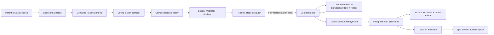

# Drawing runtime recovery and repository audit (2026-08-26)

Status: implemented; provider-backed local synthetic verification completed.
The Vercel Preview remains interface-only until it has isolated durable
Postgres storage and a valid Preview OpenAI credential.

## Outcome

The SVG/BoardOp renderer was not the primary failure. The repository already
had a capable exact compiler, scene inspection, quality budgets, animation,
replay, and broad visual fixtures. The broken boundary was ownership of a new
scene in the deployed runtime:

1. production created the Board Director only when
   `NOURA_BOARD_HARNESS_URL` was configured;
2. production configuration did not provide that optional URL, so
   `directVisual` was absent;
3. the lesson compiler treated the same missing harness as a reason to
   downgrade board-led output to conversation-led output;
4. session creation marked a provisional conversation-led lesson `ready`
   immediately, and the realtime proxy never reloaded the stronger artifact
   if it finished after Begin;
5. a conversation-led `request_visual` was rejected and the voice model was
   told to improvise the entire scene through the fast `board_ops` path.

This left no reliable owner for a new representation. A number line was only
one visible symptom: any first diagram could be misrouted, rejected, or followed
by several tool-continuation generations. The model's statement that “the
drawing system is not accepting the drawing” was a natural-language rendering
of contradictory tool state, not a renderer diagnosis.

## Runtime map

The browser remains untrusted for policy and persistence, but it is the only
environment that can truthfully answer whether the actual client compiler,
fonts, asset URLs, canvas, and responsive board can render a candidate. The
server still owns tool policy, scene authorship, validation timeouts, event
release, lesson transitions, and provider response creation.

## Root causes

### Production topology depended on an optional development mechanism

`server/app.ts` set the production board-harness URL to `null` unless an
explicit environment variable existed. It then used `openai &&
directorHarness` as the condition for constructing the live Director. A
headless browser was therefore not merely an early validation option; it was
an accidental feature switch for drawing.

The same condition affected compilation. With no harness, scene validation
returned a special failure and the compiler converted the authored lesson to
conversation-led mode. This made the deployed system structurally different
from the architecture described in the README.

### A provisional artifact could win a race against the real lesson

`createLiveCompilationService.start()` wrote a provisional conversation-led
lesson with `status: ready`, launched the real compile asynchronously, and
returned. The realtime proxy loaded the compiled record once when the control
connection opened. If Begin won the race, that call executed the provisional
blueprint for its whole lifetime even if a board-led artifact replaced it a
moment later.

### Drawing tools had overlapping and contradictory ownership

The intended policy was “fast increments versus slow new scenes,” but the
conversation-led branch rejected the slow path and told the model to put first
marks through the fast path. Prompt edits then made `board_ops` the default for
triangles, number lines, and blank boards. That pushed layout authorship back
onto the latency-optimized voice model and bypassed the Board Director.

### Visibility was represented by two incompatible shortcuts

In the committed path, a successful `board_ops` function result could be sent
before the browser acknowledged the cue, so the returned board snapshot still
said the board was empty. The existing uncommitted repair applied the batch to
`BoardContextTracker` as soon as it was sent. That removed the empty snapshot
but could lie permanently when the client later rejected the checkpoint.

The correct missing state was first paint. Animation completion is too late for
a responsive tool result; socket send is too early to claim visibility.

### Partial batches made `ok:false` ambiguous

The fast validator previously dropped invalid operations, applied the rest,
and returned `ok:false`. The model could reasonably describe that as a failed
drawing even though half a diagram had appeared. A retry could then duplicate
or conflict with the accepted subset.

### Mid-turn instruction rewrites and tool continuations amplified pauses

Realtime function output must be added as a conversation item and followed by
`response.create`. A misrouted `request_visual` followed by `board_ops` could
therefore require multiple sequential model generations before normal speech
resumed. Separately, updating the entire session instructions from
`ops_shown` raced those continuations. A working-tree patch also added narrow
per-response instructions to ordinary turns; per-response instructions risked
replacing the full persona, stage, and safety brief.

## Architectural changes

### The connected browser is the live render authority

- The Board Director is constructed whenever the provider is available;
  server-side Chromium is optional.
- A Director request carries per-session `validateScene` and `renderScene`
  ports supplied by the realtime coordinator.
- `visual_render` / `visual_render_result` render immutable candidate BoardOps
  in the connected lesson browser with the existing canonical snapshot code.
- Existing `visual_preflight` runs the real scene coordinator, annotation
  layout, inspection, and quality budget.
- The Director sees the current-board raster, proposes additive BoardOps,
  receives browser validation, sees the candidate raster, and performs its
  existing bounded vision correction loop.
- The post-Director preflight remains as a defensive contract for injected or
  alternate Director implementations.

### One owner for every new representation

- `request_visual establish` now works with or without a compiled anchor and
  in both lesson modes.
- A compiled anchor is still the fastest, most deterministic path.
- An anchor-less or learner-requested first scene goes to the Board Director.
- `board_ops` is again only the atomic fast path for highlights, updates, and
  a few marks attached to visible work.

### Visibility is a three-state protocol

| State | Evidence | Meaning |
| --- | --- | --- |
| queued | server sent a cue | not safe to describe as visible |
| presented | browser sent `ops_presented` after the committed paint | safe for tool results and the live board mirror |
| durable | browser sent `ops_shown` after draw-on completion | event is released for replay |

If rejection arrives after an anomalous presentation, the server reconstructs
the board mirror from released events. It never keeps optimistic state.

### Fast batches are atomic and observable

- Any validation or policy rejection applies zero operations.
- Missing update/highlight/erase targets are explicit rejections.
- A successful function result waits for first paint and returns
  `status: visible` with the authoritative object IDs.
- `board_tool_outcome` records bounded status, counts, rejection categories,
  and latency without raw learner content.
- `visual_request_outcome` records the slow path's action, terminal status,
  bounded reason categories, and preparation latency without the learner's
  prompt or the scene contents.

### Compilation is honest again

- Live compilation stores `pending` first; Begin remains disabled.
- The strong compiler promotes the artifact to `ready` or records `failed`.
- The pending record carries the normalized objective but is not teachable.
- Without a server harness, BoardOps still cross authored schema validation;
  the mandatory connected-browser preflight is the final gate before reveal.

### Instruction updates occur at turn boundaries

First paint updates the in-memory board mirror but does not rewrite session
instructions mid-response. The latest board context is injected before the
next text or voice learner response is created. Tool output itself carries the
same-turn authoritative snapshot.

### Explicit learner visual commands are application-owned

The provider prompt remains responsible for deciding when an unrequested
visual would help. A direct learner command is different: acknowledging
“draw/show/plot …” without creating a tracked request is a broken product
contract. The server now conservatively recognizes direct requests for
structural representations, records `learner_visual_request`, supersedes an
older in-progress storyboard while preserving its revealed marks, and starts
the Board Director after the learner-turn reset. The voice model receives an
honesty note but no longer has to choose `request_visual` for that command.

This is representation-level routing, not a number-line special case. It
covers direct requests for number lines, graphs, diagrams, drawings, shapes,
charts, timelines, arrays, coordinate planes, and related structural models.
Ordinary conversation containing those words is deliberately not intercepted.

### Local SQLite writers share a bounded lock policy

The live trace found a second independent failure: the synchronous domain
repository and asynchronous telemetry worker both wrote the local SQLite file,
while Node's default busy timeout was zero. A short telemetry insert could
therefore make a learner turn fail with `database is locked`. Both connections
now use the same 5-second busy timeout under WAL, serializing ordinary short
writer overlap instead of dropping the turn. A deterministic competing-writer
test holds the lock briefly and proves the worker waits and persists.

## What is proven offline

- Server and client TypeScript builds accept the new protocol.
- A Director request can override an absent server harness with connected
  lesson validation/render ports.
- A conversation-led first number-line representation routes to the Director.
- The browser returns canonical Director render results.
- `ops_presented` precedes `ops_shown`, and only the latter releases durable
  replay.
- A fast tool result becomes visible after first paint and contains the object
  in its board snapshot while the event is still unreleased.
- Destructive mixed fast batches reject atomically.
- A live compile remains pending until the strong board-led artifact is ready,
  even with no server-side Chromium URL.

## Remaining limitations and required live verification

- The authorized provider-backed synthetic trace produced tutor audio,
  captions, board checkpoints, provider usage, and a Director-authored 0–10
  number line with the requested five mark. The explicit command completed as
  `learner_visual_request → visual_request_outcome: ready →
  storyboard_outcome: completed` without a model visual tool call.
- The same trace measured 59.6 seconds for cold strong lesson compilation and
  15.4 seconds for the requested Director scene. Compilation is shown as a
  preparing state; Director work is asynchronous while Noura speaks. These
  are measured latency limitations, not hidden renderer stalls.
- The deployed Preview alias points at the current build, but Preview has no
  `DATABASE_URL` and intentionally reports `lessonsAvailable:false`. The
  Preview OpenAI secret and canonical/allowed origins were corrected on
  2026-08-26; a deployed goal-normalization probe now succeeds. A full
  deployed lesson smoke remains blocked by durable-storage readiness, not
  drawing code or provider authentication.
- The Director still uses two strong-model rounds for an accepted scene
  (proposal and vision). It is asynchronous and speech can continue, but a
  slow result can be abandoned if the learner moves the lesson on.
- One connected learner browser is the render authority. Disconnect or render
  timeout fails closed; it does not silently accept a scene.
- The current fast-tool JSON schema intentionally accepts a broad operation
  object and relies on the shared runtime validator. More exact per-kind JSON
  schema would further reduce retries, but it is no longer responsible for
  whole-scene authorship.
- Client render images are bounded JPEG data URLs over the control WebSocket.
  Large illustration/canvas cases need deployed payload and memory profiling.
- Native Vercel WebSocket lifetime, real microphone acoustics, and target-device
  animation timing remain production verification gates once Preview receives
  isolated durable storage.
- Historical local event data predates this topology and demonstrates that the
  number-line renderer itself worked; it is not evidence that the repaired
  deployed control path works.
