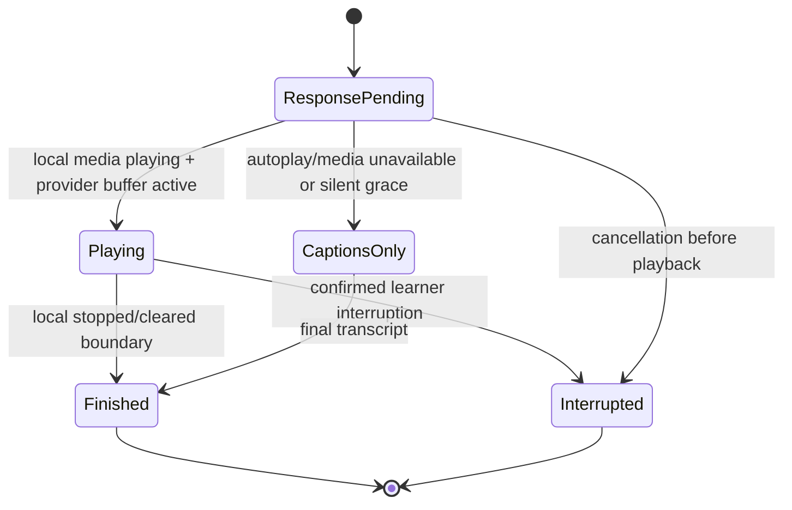

# Audio and subtitle runtime recovery (2026-08-26)

Status: implemented and verified offline plus one provider-backed local
synthetic trace; deployed Preview verification is blocked by environment
readiness (durable storage and provider credential).

## Failure chain

The Realtime provider exposes independent event streams: a WebRTC media track,
data-channel playback-buffer events, and sideband transcript/response events.
The client previously collapsed these into one approximate lifecycle.

### Audio

- `audio.play()` rejection was swallowed. A comment claimed playback would
  resume on the next gesture, but no gesture listener or recovery control
  existed.
- Provider `output_audio_buffer.started` was treated as heard audio even when
  the local media element had never begun playback.
- WebAudio analyser creation/resume was on the critical SDP path; an optional
  mic meter could abort remote audio and the control call.
- Microphone denial aborted bootstrap before any provider call existed. The
  subsequent control WebSocket therefore had no `call_id`, so tutor audio and
  subtitles both disappeared instead of continuing as a typed/listen-only
  lesson.
- Media connection failure showed an error but left response cues waiting on
  a voice object that could never produce another boundary.

### Subtitles and response-bound UI

- Transcript events represent generation, not local playout. A final
  transcript received before audio start was released immediately in full.
- Any audio stop flushed every response's phrase buffer, so a later response
  could leak into an earlier boundary.
- Final correction removed a response's captions and appended them at the end,
  allowing a late final event to reorder conversation history.
- Interruption cleared only undisplayed buffers; transcript phrases already
  streamed ahead of audio remained as stale “heard” text.
- Task and semantic cues were held only while audio was actively playing, not
  during the common generation-done-to-audio-start gap.
- A genuinely silent or failed response could leave the UI in Thinking after
  its captions had already arrived.

### Captions-only fallback

The fallback prompt instructed the model to call `semantic_visual_plan`, and
the executor still implemented it, but the advertised tool list was built by
filtering the live tools after that tool had been removed. Fallback drawing was
therefore unreachable precisely when audio/control failure forced fallback.

## Architecture

`WebRtcVoiceTransport` now distinguishes provider-buffer state from local media
truth. It correlates independently ordered response IDs, emits `started` only
after the media element is playing, reports `not_played`/connection failures,
and retries autoplay from both a visible **Enable voice** control and the next
pointer/keyboard/touch gesture.

Cancelled response IDs are suppressed in the transport itself. If a late
provider `started` event races the local clear, the media element stays muted
and the buffer is cleared again before stale audio can become audible.

Microphone failure is not voice-output failure. The peer connection uses a
`recvonly` audio transceiver when capture is denied or unavailable, preserving
typed input, tutor audio, sideband control, and subtitles. Analyser failures
degrade only energy-driven UI/barge-in observation.

An unanswered browser microphone permission prompt is also bounded. After
three seconds the call proceeds listen-only; if the unresolved permission
promise later yields a stream, its tracks are stopped immediately. This
removes the observed indefinite “Waking Noura up…” state without conflating
microphone capture with tutor audio output.

`ResponseCaptionTimeline` is an ordered ledger of child turns and tutor
responses. Each tutor group owns generated text, final text, playback state,
visible phrases, and its next phrase release time. It:

- holds generated text while audio is pending;
- releases one phrase when local playback starts and paces later phrases by a
  bounded speaking-rate estimate;
- applies final transcript correction to the same group, never the end;
- finalizes only the response whose audio stopped;
- freezes presented phrases and discards future phrases on interruption;
- releases complete text immediately when audio is unavailable;
- preserves already-presented groups across control reconnects.

Phrase pacing remains internal to each response group. The UI now projects one
cumulative caption line per response, updated in place as phrases become
audible. It no longer selects the final phrase as if it were the whole
response—a live handoff had visibly collapsed to only “question.” despite the
server holding the complete sentence.

Generic response cues no longer own subtitles. Semantic state and learner tasks
wait until playback is finished or unavailable; ordinary first-paint drawing
remains intentionally independent.

`media_playback_outcome` telemetry records bounded, content-free outcomes:
`autoplay_blocked`, `resumed`, `connection_failed`, and `not_played`.

The REST fallback again advertises its deterministic template visual tool.
It can establish/compare a safe semantic scene or highlight visible IDs, and
the normal client checkpoint validation/release path still applies.

## Offline proof

- Autoplay rejection produces no false started boundary, enters blocked state,
  retries successfully, then produces one local start/stop pair.
- Microphone denial produces a listen-only SDP offer instead of aborting.
- An unresolved microphone prompt times out to listen-only and a late stream
  is stopped rather than attached.
- Final subtitles remain hidden before audio start and advance phrase by
  phrase during playback.
- Late final correction preserves consecutive response/learner ordering.
- Finishing one response never flushes a later pending response.
- Interruption preserves the presented phrase and drops its unheard tail.
- Media failure releases useful captions and finishes response-bound UI.
- Task delivery is held through the pre-audio gap.
- Browser E2E covers consecutive responses, a late correction, interruption,
  autoplay blocking, captions-only display, and **Enable voice** recovery.
- Fallback tests prove `semantic_visual_plan` is advertised and its checkpoints
  reach the board event stream.
- A provider-backed Chrome trace observed real tutor audio durations and
  captions, then exposed and verified the cumulative-caption projection fix.
- The current Vercel CLI production build completes successfully under its
  per-function TypeScript compiler, after making discriminated unions and
  manipulative coordinate tuples explicit for that deployment boundary.

## Remaining live gates

- Real browser autoplay policy varies by browser, OS, prior media engagement,
  and device settings. Offline tests prove recovery control flow, not speaker
  audibility.
- Provider playback-buffer events and sideband transcript ordering need one
  authorized deployed synthetic trace on target browsers.
- Phrase pacing is intentionally approximate because the Realtime transcript
  events do not provide word timestamps. The app does not claim word-perfect
  karaoke synchronization.
- ICE restart/renegotiation is still deferred. A terminal peer failure becomes
  sideband captions-only output rather than reconnecting the media plane.
